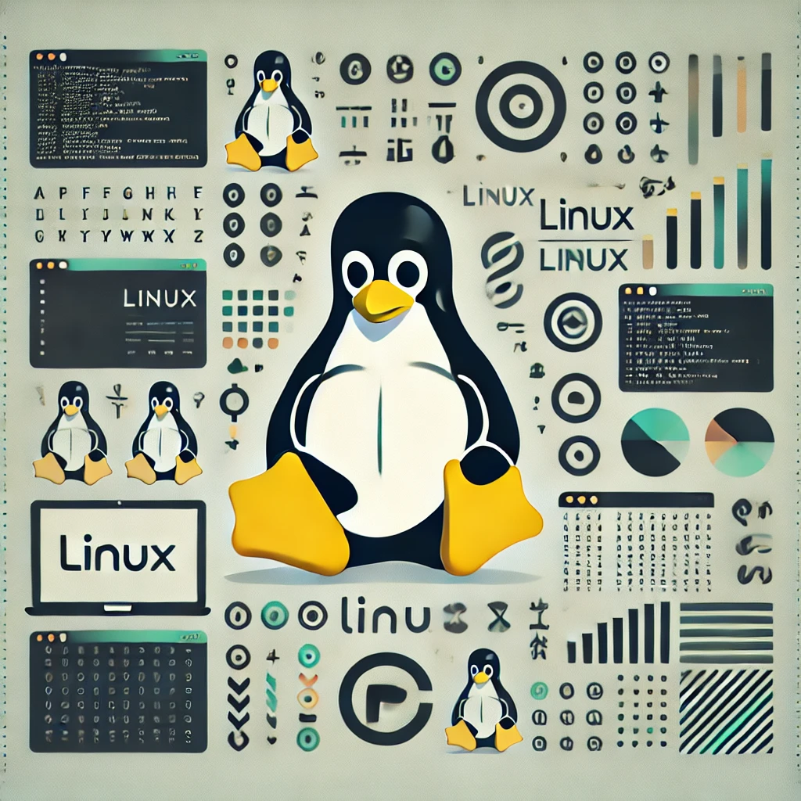

# Learn Linux with Carlitos

Welcome to this repository, created to help you understand and improve your Linux skills. Here you will find notes, guides, and practical tips to set up and manage a Linux environment, with the goal of establishing a solid foundation for effective Linux usage and administration.

## General Objectives

- Establish a well-organized and optimized environment for working on Linux.

## Specific Objectives

1. **Basic Linux Setup**
   - Install a Linux distribution (e.g., Ubuntu, Fedora, Arch Linux).
   - Configure user accounts, permissions, and basic settings.

2. **System Management and Navigation**
   - Learn essential commands for file and directory management.
   - Understand Linux file system hierarchy and permissions.

3. **Package Management**
   - Install, update, and remove software packages using various package managers (e.g., `apt`, `yum`, `pacman`).
   - Understand the basics of dependencies and package sources.

4. **System Monitoring and Process Management**
   - Use commands to monitor system performance (e.g., `top`, `htop`, `ps`).
   - Manage system processes, services, and system resources.

## Resources and References

- Visit my YouTube channel for video tutorials on Linux and development: [Developing With Carlitos](https://www.youtube.com/@DevelopingWithCarlitos).
- [Linux Documentation](https://www.kernel.org/doc/html/latest/) – Official Linux documentation.
- [Linux Command Cheat Sheet](https://www.commandlinefu.com) – Commonly used Linux commands and examples.

---

## Commands and Configuration for Linux

### 01 - Basic System Commands

| Command                       | Description                                                                |
| :---------------------------: | :------------------------------------------------------------------------- |
| `ls`                          | Lists files and directories in the current directory                       |
| `cd /path/to/directory`       | Changes the current directory                                              |
| `pwd`                         | Prints the current working directory                                       |
| `mkdir new_folder`            | Creates a new directory                                                    |
| `rm filename`                 | Removes a file                                                             |
| `rm -r foldername`            | Removes a directory and its contents                                       |
| `cp source_file destination`  | Copies a file to a specified destination                                   |
| `mv source destination`       | Moves or renames a file or directory                                       |

### 02 - System and Package Management Commands

| Command                              | Description                                                          |
| :----------------------------------: | :------------------------------------------------------------------- |
| `sudo apt update`                    | Updates the package lists (Debian/Ubuntu)                            |
| `sudo apt upgrade`                   | Upgrades all installed packages (Debian/Ubuntu)                      |
| `sudo yum update`                    | Updates packages (RHEL/Fedora)                                       |
| `sudo pacman -Syu`                   | Synchronizes and updates packages (Arch Linux)                       |
| `top`                                | Displays active processes and system resource usage                  |
| `htop`                               | Enhanced version of `top` (requires installation)                    |
| `ps aux`                             | Shows detailed information about running processes                   |
| `kill PID`                           | Terminates a process by its PID                                      |
| `df -h`                              | Shows disk usage by filesystem                                       |
| `free -h`                            | Displays free and used memory in the system                          |

---

With these commands and resources, you'll start gaining confidence in using Linux. Explore each command, understand its purpose, and begin mastering Linux as a powerful development environment!
